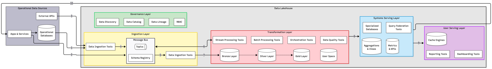

# BI & Operational Data Architecture

## Overview

This document describes a **Data Lakehouse** architecture that serves two goals:

1. **Business Intelligence** — batch-oriented analytics, dashboards, and reporting powered by a medallion storage model.
2. **Operational systems** — real-time data products (alerts, live feeds, ML inference) running off the same platform.

Both goals share a single ingestion spine (a message bus) and a single storage layer (the lakehouse), avoiding duplicate pipelines.

> **Note on tool choices** — The tools and providers listed throughout this document are illustrative. Actual choices depend on many factors, including:
> - **Team expertise** — familiarity with a tool reduces onboarding cost and operational risk
> - **Cloud provider** — existing AWS/GCP/Azure contracts favour managed services from that ecosystem
> - **Budget** — OSS tools lower licensing cost but shift burden to operational overhead; managed services invert that trade-off
> - **Scale** — data volume and query concurrency determine whether a lightweight tool suffices or a distributed engine is needed
> - **Latency requirements** — sub-second SLAs push toward stream-first designs; hourly batch windows allow simpler stacks
> - **Compliance and data residency** — regulatory constraints (GDPR, HIPAA, SOC 2) can disqualify certain vendors or cloud regions
> - **Existing infrastructure** — integrating with incumbent databases, identity providers, or BI tools often outweighs the ideal-stack choice
> - **Ecosystem integration** — how well tools interoperate (connectors, metadata standards, auth) affects total complexity

---

## Architecture Diagram

The diagram is presented below and it uses the following conventions:
- it is organized into six zones represented by colored rectangles
- each zone contains a set of services/tools represented by squared boxes
- each zone also contains a set of logical data stores represented by cylinders
- the arrows represent the flow of data, and the main ones are numbered for further description
- the name of real services and how the parts works together is explained after the image
- I've only presented tools I've used before or I know how they work
- see [`architecture-diagram.mmd`](./architecture-diagram.mmd) for the full Mermaid source.

### Diagram

#### ⚫ Operational Data Sources

##### Tools
| Service Type | Description | OSS Tools | Providers |
|---|---|---|---|
| External APIs | Third-party data sources exposing data via REST / GraphQL | — | Google Sheets, Google Ads |
| Apps & Services | Internal microservices and client applications that write to operational databases and emit events to the message bus | FastAPI, Spring Boot, Node.js | — |

##### Data
| Logical Data Store | Description |
|---|---|
| Operational Databases | Transactional stores that are the system of record for business operations — e.g. PostgreSQL, MariaDB (OSS); Amazon RDS (managed) |

---

#### 🟡 Ingestion Layer
Responsible for moving data from sources into the lakehouse, via batch pulls or real-time event streaming.

##### Tools
| Service Type | Description | OSS Tools | Providers |
|---|---|---|---|
| Batch Ingestion | Periodically extracts data from operational databases and external APIs | Airbyte, Debezium (CDC) | AWS DMS |
| Stream Ingestion | Forwards events arriving on the message bus into the Bronze layer | Apache Flink, Apache Spark | — |
| Schema Registry | Enforces and versions message schemas (Avro / Protobuf) so producers and consumers stay in sync | Apache Pulsar (built-in), Confluent Schema Registry | — |

##### Data
| Logical Data Store | Description |
|---|---|
| Topics | Message bus partitioned by domain/entity, carrying raw change events and application events in real time |

---

#### 🔴 Transformation Layer
Hosts the medallion storage layers and all tools that refine raw data into trusted, analytics-ready assets.

##### Tools
| Service Type | Description | OSS Tools | Providers |
|---|---|---|---|
| Batch Processing | Scheduled, large-scale transformations over the medallion layers | Apache Spark, dbt Core | Databricks |
| Stream Processing | Low-latency transformation and enrichment of events in motion | Apache Flink, Spark Structured Streaming | — |
| Orchestration | DAG scheduling, dependency resolution, and pipeline retries | Apache Airflow | Astronomer |
| Data Quality | Automated schema, freshness, and integrity checks run as pipeline gates | Great Expectations, dbt tests | — |

##### Data
| Logical Data Store | Description |
|---|---|
| Bronze Layer | Landing zone — raw, unmodified data ingested from sources, partitioned by ingestion date. Preserves full history for reprocessing |
| Silver Layer | Cleaned and conformed data — deduplication, schema normalization, type casting, and light business rules applied |
| Gold Layer | Aggregated, business-ready datasets modelled around domains (facts & dimensions). Directly consumed by downstream serving and analytics |
| User Space | Sandbox area for analysts to create ad-hoc tables and exploratory datasets without polluting governed layers |

---

#### 🔵 Systems Serving Layer
Materialises and exposes analytics-ready data to downstream consumers through specialized engines and query federation.

##### Tools
| Service Type | Description | OSS Tools | Providers |
|---|---|---|---|
| Specialized Databases | High-performance stores purpose-built for specific access patterns (time-series, wide-column, OLAP) | InfluxDB, Cassandra | Redshift, Snowflake |
| Query Federation | SQL query interface over distributed or heterogeneous data stores | Apache Hive, Cloudera Impala, Presto | — |

##### Data
| Logical Data Store | Description |
|---|---|
| Aggregations & Views | Pre-computed rollups (hourly, daily, weekly) and reusable views stored for instant retrieval, avoiding repeated full-table scans |
| Metrics & KPIs | Operational and product metrics alongside named, versioned key business indicators with agreed calculation logic and ownership — consumed by dashboards, alerting systems, and ML pipelines |

---

#### 🟣 User Serving Layer
Surfaces data to end users (analysts, operators, executives) through interactive dashboards, scheduled reports, and cached query results.

##### Tools
| Service Type | Description | OSS Tools | Providers |
|---|---|---|---|
| Dashboarding | Self-service exploration and executive dashboards | Grafana, Redash | Tableau, Looker |
| Reporting | Scheduled or on-demand report generation and distribution | Redash, Grafana | Tableau |

##### Data
| Logical Data Store | Description |
|---|---|
| Cache Engines | Short-lived result caches that accelerate repeated dashboard queries and reduce pressure on query engines (e.g. Redis, Memcached) |

---

#### 🟢 Governance Layer
Cross-cutting layer that ensures data is discoverable, trustworthy, and access-controlled across every zone.

##### Tools
| Service Type | Description | OSS Tools | Providers |
|---|---|---|---|
| Data Catalog | Centralised inventory of datasets, schemas, owners, and descriptions | — | Atlan |
| Data Lineage | Tracks end-to-end data flow from source to report, enabling impact analysis and debugging | Marquez | Atlan |
| RBAC | Role-based access control policies applied at the table/column level across all layers and serving engines | — | AWS IAM |
| Data Discovery | Search and recommendation interface for finding datasets, metrics, and owners | — | Atlan |
