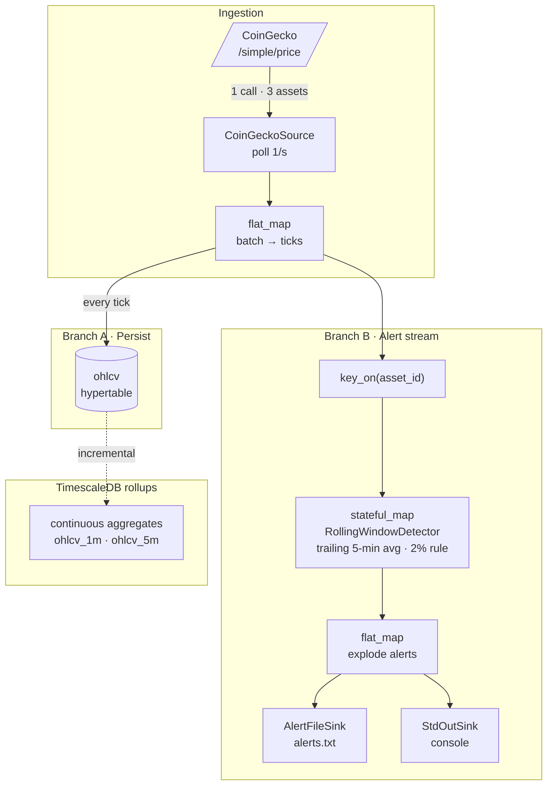

# Real-time crypto feed → TimescaleDB + alert stream

A small streaming tool that polls [CoinGecko](https://www.coingecko.com/api/documentations/v3)
once per second for **BTC, ETH, ZEC** and, in a single push-based pipeline:

1. **stores the feed** in PostgreSQL (TimescaleDB), and
2. **emits an alert stream** whenever price or volume moves more than **2%** from the
   trailing **5-minute** average.

It is built as one **[Bytewax](https://bytewax.io/)** dataflow — a Python-native stream
processor — so the polled tick is *pushed* through the graph to both persistence and
alerting in the same process. Nothing reads back from the database to raise alerts.

---

## Architecture



The **alert baseline** (the trailing 5-minute rollup) is computed *in the stream* by
`stateful_map`, which fires on the exact deviating tick. The **OHLCV candles**
(`ohlcv_1m`, `ohlcv_5m`) are computed *in the database* as continuous aggregates, for
retrieval — see [Schema rationale](#schema-rationale).

---

## Prerequisites

| Tool | Version | Notes |
|---|---|---|
| [Docker](https://docs.docker.com/get-docker/) + Compose | any recent | runs TimescaleDB; needs host port **15432** free |
| [`uv`](https://docs.astral.sh/uv/) | ≥ 0.4 | manages the Python 3.12 venv and deps |
| Python | 3.12 | pinned (`.python-version`); `uv` will fetch it if absent — bytewax ships no 3.13 wheel yet |
| CoinGecko demo API key | optional | only needed for an uninterrupted 1/s feed (see [rate limits](#running-it)) |

---

## Running it

```bash
make up        # 1. start TimescaleDB (host port 15432)
uv sync        # 2. install dependencies
make seed      # 3. apply schema + seed the assets table
make run       # 4. start the feed (Ctrl-C to stop)
```

In another terminal, watch the two outputs:

```bash
make logs                                   # tail alerts.txt
make psql                                   # then: SELECT * FROM ohlcv ORDER BY ingested_at DESC LIMIT 10;
```

Configuration is via environment variables (see `.env.example`); copy it to `.env` to
override defaults such as `ASSET_IDS`, `ALERT_THRESHOLD`, `ALERT_WINDOW_S`, or
`COINGECKO_API_KEY`.

```bash
make test      # unit tests
make lint      # ruff
```

> **Rate limits.** A true 1/s cadence is 60 calls/min, above CoinGecko's free public limit
> (~30/min), so you will see `429`s without an API key. The client retries with backoff and
> the source skips a failed poll rather than crashing the stream. Set `COINGECKO_API_KEY`
> for an uninterrupted 1/s feed, or raise `POLL_INTERVAL_S`.

---

## Schema rationale

Two tables, as recommended by the challenge (`db/schema.sql`):

- **`assets`** — *maestro* of digital assets: slow-changing descriptive metadata
  (`symbol`, `name`, `max_supply`, …). Seeded from `/coins/markets`, which — unlike
  `/simple/price` — carries symbol/name.
- **`ohlcv`** — the historical feed, a TimescaleDB **hypertable** partitioned by time.

**Why raw ticks, not 1-second candles.** A single CoinGecko reading is a *tick* (a price
snapshot), not a candle. OHLCV is a *candle*: open/high/low/close/volume summarising a time
interval with many trades. At 1-second granularity a single reading collapses to
`O=H=L=C=price` — four columns carrying no information. So we store the raw tick and derive
**real candles** by aggregating ticks into time buckets via continuous aggregates
(`ohlcv_1m`, `ohlcv_5m`). That derivation is also the scalability/retrieval answer below.

`ts` (source `last_updated_at`) and `ingested_at` (our poll time) are stored separately so
you can tell "when the price actually changed" from "when we observed it" — useful because
the free tier only refreshes every ~30–60s (see trade-offs).

---

## Trade-offs & known limitations

- **Volume is trailing-24h, not per-interval.** CoinGecko exposes only a rolling
  `usd_24h_vol` on these endpoints, not volume traded within each second/minute. The volume
  alert therefore operates on that 24h figure. A true per-interval volume would need an
  exchange-level feed (e.g. a websocket trade stream).
- **Free-tier refresh cadence.** The source data updates roughly every 30–60s, so most 1/s
  polls return an identical reading. We store every poll (matching the challenge's
  2,592,000 rows/asset/month), keeping both timestamps; deduping on `ts` is a config change
  away if storage matters more than a fixed cadence.
- **Single worker.** One process is plenty for 3 assets at 1/s. Bytewax can scale to
  multiple workers/processes; the Postgres and file sinks are written as per-worker
  partitions so that path is open.

---

## Scalability

> Each new asset adds ~2.59M rows/month; the historical table grows fast.

The current implementation already addresses both of the concerns (explained below). Another
option would be to use the a lakehouse architecture for long term storage, consolidation and 
distribution of the data.

**1. Scale without losing information — TimescaleDB hypertable + compression.**
`ohlcv` is a hypertable auto-partitioned into 1-day **chunks**. Chunks older than 7 days are
**columnar-compressed** (`compress_segmentby = asset_id`), which is *lossless* — the raw
ticks stay fully queryable, just ~10× smaller — so full history remains affordable instead
of being deleted. (A retention policy to drop very old raw ticks is included but disabled,
precisely because the goal is to scale *without* losing information.)

**2. Optimize retrieval speed — continuous aggregates + partition pruning + indexing.**
- **Continuous aggregates** (`ohlcv_1m`, `ohlcv_5m`) keep pre-computed candles incrementally
  up to date. Dashboards query these small rollup tables instead of scanning millions of raw
  ticks — orders of magnitude less work. (`materialized_only = false` adds real-time
  aggregation so results are never stale.)
- **Partition pruning:** time-bounded queries touch only the relevant daily chunks.
- **Index** `(asset_id, ingested_at DESC)` serves "latest price" / recent-window lookups.

---

## Extension

The app generalises along four independent axes, mostly via config (`config.py`):

- **More assets** — add CoinGecko ids to `ASSET_IDS`; the maestro re-seeds and the feed,
  storage, and per-asset alert state all fan out automatically. No code change.
- **Different metrics** — `market_cap` and `change_24h` are already stored; alerting on a new
  metric is one more `_check(...)` line, and the detector is reused unchanged.
- **Different rules / purposes** — `ALERT_WINDOW_S` and `ALERT_THRESHOLD` are config; richer
  logic (e.g. z-score, multi-window) drops into `RollingWindowDetector` behind the same
  `stateful_map`.
- **Different outputs** — alerting is "just another sink." Swapping `alerts.txt` for Kafka,
  SNS, or Pub/Sub is a new `DynamicSink` added to `dataflow.py`; the detection path is
  untouched.

---

## Tests

`uv run pytest` (12 tests):
- `test_alerting.py` — the 2% rule, price vs volume, warm-up suppression, and trailing-window
  eviction of stale samples.
- `test_coingecko.py` — parsing captured real payloads into `Tick`/`Asset`, source-timestamp
  handling, missing-currency skips, and null `max_supply` (ETH).
