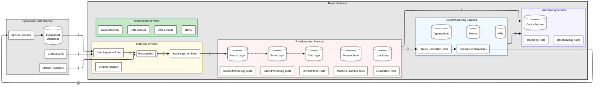

```mermaid
---
config:
  layout: elk
  theme: neo
  look: neo
---
flowchart LR
 subgraph ODS["Operational Data Sources"]
    direction LR
        ExtAPIs["External APIs"]
        SourceDBs[("Operational<br>Databases")]
        AppsServices["Apps & Services"]
        StreamProducers["Stream Producers"]
  end
 subgraph IngestionServices["Ingestion Services"]
    direction LR
        MessageBus["Message Bus"]
        BatchIngestTools["Data Ingestion Tools"]
        StreamIngestTools["Data Ingestion Tools"]
        SchemaRegistry["Schema Registry"]
  end
 subgraph TransformationServices["Transformation Services"]
    direction LR
        BronzeLayer[("Bronze Layer")]
        SilverLayer[("Silver Layer")]
        GoldLayer[("Gold Layer")]
        UserSpace[("User Space")]
        FeatureStore[("Feature Store")]
        BatchProcessing["Batch Processing Tools"]
        Orchestration["Orchestration Tools"]
        StreamProcessing["Stream Processing Tools"]
        ExplorationTools["Machine Learning Tools"]
        MLTools["Exploration Tools"]
  end
 subgraph SystemsServingServices["Systems Serving Services"]
    direction LR
        Aggregations[("Aggregations")]
        KPIs[("KPIs")]
        Metrics[("Metrics")]
        SpecializedDBs["Specialized Databases"]
        QueryFederation["Query Federation Tools"]
  end
 subgraph UserServingServices["User Serving Services"]
    direction LR
        Dashboarding["Dashboarding Tools"]
        CacheEngines[("Cache Engines")]
        ReportingTools["Reporting Tools"]
  end
 subgraph GovernanceServices["Governance Services"]
    direction LR
        DataCatalog["Data Catalog"]
        DataLineage["Data Lineage"]
        RBAC["RBAC"]
        DataDiscovery["Data Discovery"]
  end
 subgraph DLH["Data Lakehouse"]
    direction LR
        IngestionServices
        TransformationServices
        SystemsServingServices
        UserServingServices
        GovernanceServices
  end
    ExtAPIs -- 2 --> BatchIngestTools
    SourceDBs -- 1 --> BatchIngestTools
    BatchIngestTools -- 4 --> MessageBus
    StreamProducers -- 3 --> MessageBus
    MessageBus -- 5 --> StreamIngestTools
    StreamIngestTools -- 6 --> BronzeLayer
    SystemsServingServices -- 8 --> UserServingServices
    AppsServices --> SourceDBs
    BronzeLayer -.-> SilverLayer
    SilverLayer -.-> GoldLayer
    FeatureStore ~~~ UserSpace
    StreamProcessing ~~~ BatchProcessing
    BatchProcessing ~~~ Orchestration
    GoldLayer ~~~ FeatureStore
    Orchestration ~~~ ExplorationTools
    ExplorationTools ~~~ MLTools
    DataCatalog ~~~ DataLineage
    DataLineage ~~~ RBAC
    Aggregations ~~~ Metrics
    Metrics ~~~ KPIs
    QueryFederation --> SpecializedDBs
    ReportingTools ~~~ Dashboarding
    DataDiscovery ~~~ DataCatalog
    TransformationServices -- 9 --> UserServingServices
    TransformationServices -- 7 --> QueryFederation
    SpecializedDBs -- 10 --> AppsServices

    MessageBus@{ shape: h-cyl}
    classDef default stroke:#000000,fill:#ffffff,stroke-width:1px,color:#000000
    style IngestionServices fill:#fffbe6,stroke:#facc15,stroke-width:2px
    style TransformationServices fill:#fef2f2,stroke:#f87171,stroke-width:2px
    style SystemsServingServices fill:#f0f9ff,stroke:#38bdf8,stroke-width:2px
    style UserServingServices fill:#f5f3ff,stroke:#a78bfa,stroke-width:2px
    style GovernanceServices fill:#C8E6C9,stroke:#00C853,stroke-width:2px
    style ODS stroke:#000000,fill:#e6e6e6,stroke-width:1px
    style DLH stroke:#000000,fill:#e6e6e6,stroke-width:2px
```